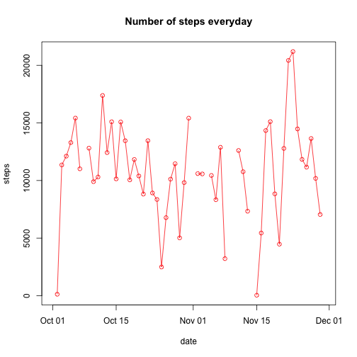
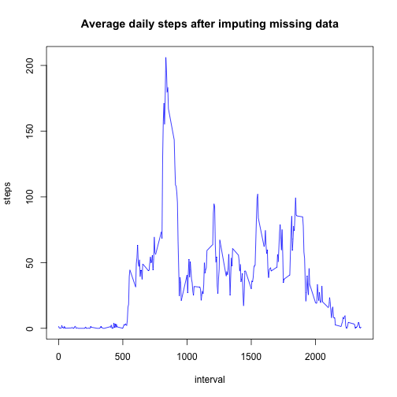
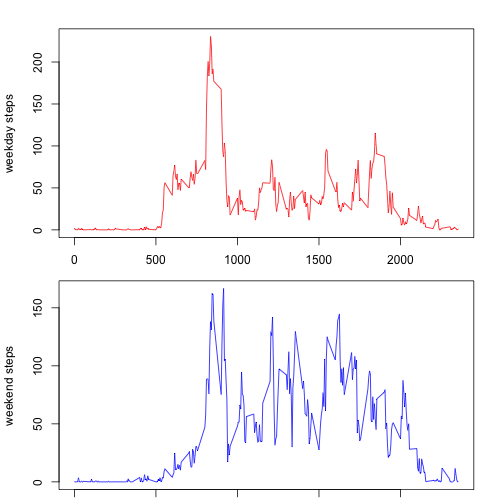

# Reproducible Research: Peer Assessment 1
=============================================

## Loading and preprocessing the data

```r
# loading csv data to data table
activity <- read.table("activity.csv", sep=",", header=TRUE)
activity$date <- as.Date(activity$date, format="%Y-%m-%d")
library(data.table)
DT <- data.table(activity)
summary(DT)
```

```
##      steps            date               interval   
##  Min.   :  0.0   Min.   :2012-10-01   Min.   :   0  
##  1st Qu.:  0.0   1st Qu.:2012-10-16   1st Qu.: 589  
##  Median :  0.0   Median :2012-10-31   Median :1178  
##  Mean   : 37.4   Mean   :2012-10-31   Mean   :1178  
##  3rd Qu.: 12.0   3rd Qu.:2012-11-15   3rd Qu.:1766  
##  Max.   :806.0   Max.   :2012-11-30   Max.   :2355  
##  NA's   :2304
```


## What is mean total number of steps taken per day?

```r
par(mfrow=c(1,1))
plot(DT[,sum(steps), by=date], col="red", type="o",main="Number of steps everyday", xlab="date", ylab="steps")
```

 

```r
# mean of number of steps taken per day
DT[, mean(steps, na.rm=TRUE), by=date]
```

```
##           date      V1
##  1: 2012-10-01     NaN
##  2: 2012-10-02  0.4375
##  3: 2012-10-03 39.4167
##  4: 2012-10-04 42.0694
##  5: 2012-10-05 46.1597
##  6: 2012-10-06 53.5417
##  7: 2012-10-07 38.2465
##  8: 2012-10-08     NaN
##  9: 2012-10-09 44.4826
## 10: 2012-10-10 34.3750
## 11: 2012-10-11 35.7778
## 12: 2012-10-12 60.3542
## 13: 2012-10-13 43.1458
## 14: 2012-10-14 52.4236
## 15: 2012-10-15 35.2049
## 16: 2012-10-16 52.3750
## 17: 2012-10-17 46.7083
## 18: 2012-10-18 34.9167
## 19: 2012-10-19 41.0729
## 20: 2012-10-20 36.0938
## 21: 2012-10-21 30.6285
## 22: 2012-10-22 46.7361
## 23: 2012-10-23 30.9653
## 24: 2012-10-24 29.0104
## 25: 2012-10-25  8.6528
## 26: 2012-10-26 23.5347
## 27: 2012-10-27 35.1354
## 28: 2012-10-28 39.7847
## 29: 2012-10-29 17.4236
## 30: 2012-10-30 34.0938
## 31: 2012-10-31 53.5208
## 32: 2012-11-01     NaN
## 33: 2012-11-02 36.8056
## 34: 2012-11-03 36.7049
## 35: 2012-11-04     NaN
## 36: 2012-11-05 36.2465
## 37: 2012-11-06 28.9375
## 38: 2012-11-07 44.7326
## 39: 2012-11-08 11.1771
## 40: 2012-11-09     NaN
## 41: 2012-11-10     NaN
## 42: 2012-11-11 43.7778
## 43: 2012-11-12 37.3785
## 44: 2012-11-13 25.4722
## 45: 2012-11-14     NaN
## 46: 2012-11-15  0.1424
## 47: 2012-11-16 18.8924
## 48: 2012-11-17 49.7882
## 49: 2012-11-18 52.4653
## 50: 2012-11-19 30.6979
## 51: 2012-11-20 15.5278
## 52: 2012-11-21 44.3993
## 53: 2012-11-22 70.9271
## 54: 2012-11-23 73.5903
## 55: 2012-11-24 50.2708
## 56: 2012-11-25 41.0903
## 57: 2012-11-26 38.7569
## 58: 2012-11-27 47.3819
## 59: 2012-11-28 35.3576
## 60: 2012-11-29 24.4688
## 61: 2012-11-30     NaN
##           date      V1
```

```r
# median of number of steps taken everyday
DT[, as.double(median(steps, na.rm = TRUE)), by=date] 
```

```
##           date V1
##  1: 2012-10-01 NA
##  2: 2012-10-02  0
##  3: 2012-10-03  0
##  4: 2012-10-04  0
##  5: 2012-10-05  0
##  6: 2012-10-06  0
##  7: 2012-10-07  0
##  8: 2012-10-08 NA
##  9: 2012-10-09  0
## 10: 2012-10-10  0
## 11: 2012-10-11  0
## 12: 2012-10-12  0
## 13: 2012-10-13  0
## 14: 2012-10-14  0
## 15: 2012-10-15  0
## 16: 2012-10-16  0
## 17: 2012-10-17  0
## 18: 2012-10-18  0
## 19: 2012-10-19  0
## 20: 2012-10-20  0
## 21: 2012-10-21  0
## 22: 2012-10-22  0
## 23: 2012-10-23  0
## 24: 2012-10-24  0
## 25: 2012-10-25  0
## 26: 2012-10-26  0
## 27: 2012-10-27  0
## 28: 2012-10-28  0
## 29: 2012-10-29  0
## 30: 2012-10-30  0
## 31: 2012-10-31  0
## 32: 2012-11-01 NA
## 33: 2012-11-02  0
## 34: 2012-11-03  0
## 35: 2012-11-04 NA
## 36: 2012-11-05  0
## 37: 2012-11-06  0
## 38: 2012-11-07  0
## 39: 2012-11-08  0
## 40: 2012-11-09 NA
## 41: 2012-11-10 NA
## 42: 2012-11-11  0
## 43: 2012-11-12  0
## 44: 2012-11-13  0
## 45: 2012-11-14 NA
## 46: 2012-11-15  0
## 47: 2012-11-16  0
## 48: 2012-11-17  0
## 49: 2012-11-18  0
## 50: 2012-11-19  0
## 51: 2012-11-20  0
## 52: 2012-11-21  0
## 53: 2012-11-22  0
## 54: 2012-11-23  0
## 55: 2012-11-24  0
## 56: 2012-11-25  0
## 57: 2012-11-26  0
## 58: 2012-11-27  0
## 59: 2012-11-28  0
## 60: 2012-11-29  0
## 61: 2012-11-30 NA
##           date V1
```


## What is the average daily activity pattern?

```r
plot(DT[, mean(steps , na.rm = TRUE), by=interval], type='l', main="Average daily steps", ylab="steps", xlab="interval")
```

 

```r
# interval containing maximum number of steps
DT[, mean(steps , na.rm = TRUE), by=interval][which.max(DT[, mean(steps , na.rm = TRUE), by=interval]$V1)]
```

```
##    interval    V1
## 1:      835 206.2
```


## Imputing missing values
Using interval average for fillin missing data. 

```r
# total missing values
DT[is.na(steps)]
```

```
##       steps       date interval
##    1:    NA 2012-10-01        0
##    2:    NA 2012-10-01        5
##    3:    NA 2012-10-01       10
##    4:    NA 2012-10-01       15
##    5:    NA 2012-10-01       20
##   ---                          
## 2300:    NA 2012-11-30     2335
## 2301:    NA 2012-11-30     2340
## 2302:    NA 2012-11-30     2345
## 2303:    NA 2012-11-30     2350
## 2304:    NA 2012-11-30     2355
```

```r
interval_avg <- DT[, mean(steps , na.rm = TRUE), by=interval]
missing_val <- lapply(DT[is.na(steps)]$interval, function(x)(interval_avg[interval==x]$V1))
MT <- DT
MT[is.na(steps)]$steps <- missing_val
# MT has filled in all NA's
summary(MT)
```

```
##      steps            date               interval   
##  Min.   :  0.0   Min.   :2012-10-01   Min.   :   0  
##  1st Qu.:  0.0   1st Qu.:2012-10-16   1st Qu.: 589  
##  Median :  0.0   Median :2012-10-31   Median :1178  
##  Mean   : 37.3   Mean   :2012-10-31   Mean   :1178  
##  3rd Qu.: 27.0   3rd Qu.:2012-11-15   3rd Qu.:1766  
##  Max.   :806.0   Max.   :2012-11-30   Max.   :2355
```

```r
# mean after fillin data
MT[, mean(steps, na.rm=TRUE), by=date]
```

```
##           date      V1
##  1: 2012-10-01 36.9479
##  2: 2012-10-02  0.4375
##  3: 2012-10-03 39.4167
##  4: 2012-10-04 42.0694
##  5: 2012-10-05 46.1597
##  6: 2012-10-06 53.5417
##  7: 2012-10-07 38.2465
##  8: 2012-10-08 36.9479
##  9: 2012-10-09 44.4826
## 10: 2012-10-10 34.3750
## 11: 2012-10-11 35.7778
## 12: 2012-10-12 60.3542
## 13: 2012-10-13 43.1458
## 14: 2012-10-14 52.4236
## 15: 2012-10-15 35.2049
## 16: 2012-10-16 52.3750
## 17: 2012-10-17 46.7083
## 18: 2012-10-18 34.9167
## 19: 2012-10-19 41.0729
## 20: 2012-10-20 36.0938
## 21: 2012-10-21 30.6285
## 22: 2012-10-22 46.7361
## 23: 2012-10-23 30.9653
## 24: 2012-10-24 29.0104
## 25: 2012-10-25  8.6528
## 26: 2012-10-26 23.5347
## 27: 2012-10-27 35.1354
## 28: 2012-10-28 39.7847
## 29: 2012-10-29 17.4236
## 30: 2012-10-30 34.0938
## 31: 2012-10-31 53.5208
## 32: 2012-11-01 36.9479
## 33: 2012-11-02 36.8056
## 34: 2012-11-03 36.7049
## 35: 2012-11-04 36.9479
## 36: 2012-11-05 36.2465
## 37: 2012-11-06 28.9375
## 38: 2012-11-07 44.7326
## 39: 2012-11-08 11.1771
## 40: 2012-11-09 36.9479
## 41: 2012-11-10 36.9479
## 42: 2012-11-11 43.7778
## 43: 2012-11-12 37.3785
## 44: 2012-11-13 25.4722
## 45: 2012-11-14 36.9479
## 46: 2012-11-15  0.1424
## 47: 2012-11-16 18.8924
## 48: 2012-11-17 49.7882
## 49: 2012-11-18 52.4653
## 50: 2012-11-19 30.6979
## 51: 2012-11-20 15.5278
## 52: 2012-11-21 44.3993
## 53: 2012-11-22 70.9271
## 54: 2012-11-23 73.5903
## 55: 2012-11-24 50.2708
## 56: 2012-11-25 41.0903
## 57: 2012-11-26 38.7569
## 58: 2012-11-27 47.3819
## 59: 2012-11-28 35.3576
## 60: 2012-11-29 24.4688
## 61: 2012-11-30 36.9479
##           date      V1
```

```r
# median after fillin data
MT[, as.double(median(steps, na.rm = TRUE)), by=date] 
```

```
##           date   V1
##  1: 2012-10-01 33.5
##  2: 2012-10-02  0.0
##  3: 2012-10-03  0.0
##  4: 2012-10-04  0.0
##  5: 2012-10-05  0.0
##  6: 2012-10-06  0.0
##  7: 2012-10-07  0.0
##  8: 2012-10-08 33.5
##  9: 2012-10-09  0.0
## 10: 2012-10-10  0.0
## 11: 2012-10-11  0.0
## 12: 2012-10-12  0.0
## 13: 2012-10-13  0.0
## 14: 2012-10-14  0.0
## 15: 2012-10-15  0.0
## 16: 2012-10-16  0.0
## 17: 2012-10-17  0.0
## 18: 2012-10-18  0.0
## 19: 2012-10-19  0.0
## 20: 2012-10-20  0.0
## 21: 2012-10-21  0.0
## 22: 2012-10-22  0.0
## 23: 2012-10-23  0.0
## 24: 2012-10-24  0.0
## 25: 2012-10-25  0.0
## 26: 2012-10-26  0.0
## 27: 2012-10-27  0.0
## 28: 2012-10-28  0.0
## 29: 2012-10-29  0.0
## 30: 2012-10-30  0.0
## 31: 2012-10-31  0.0
## 32: 2012-11-01 33.5
## 33: 2012-11-02  0.0
## 34: 2012-11-03  0.0
## 35: 2012-11-04 33.5
## 36: 2012-11-05  0.0
## 37: 2012-11-06  0.0
## 38: 2012-11-07  0.0
## 39: 2012-11-08  0.0
## 40: 2012-11-09 33.5
## 41: 2012-11-10 33.5
## 42: 2012-11-11  0.0
## 43: 2012-11-12  0.0
## 44: 2012-11-13  0.0
## 45: 2012-11-14 33.5
## 46: 2012-11-15  0.0
## 47: 2012-11-16  0.0
## 48: 2012-11-17  0.0
## 49: 2012-11-18  0.0
## 50: 2012-11-19  0.0
## 51: 2012-11-20  0.0
## 52: 2012-11-21  0.0
## 53: 2012-11-22  0.0
## 54: 2012-11-23  0.0
## 55: 2012-11-24  0.0
## 56: 2012-11-25  0.0
## 57: 2012-11-26  0.0
## 58: 2012-11-27  0.0
## 59: 2012-11-28  0.0
## 60: 2012-11-29  0.0
## 61: 2012-11-30 33.5
##           date   V1
```

```r
# plot of the data before and after fillin missing values
par(mfrow=c(1,1))
plot(MT[, mean(steps , na.rm = TRUE), by=interval], type='l', main="Average daily steps after imputing missing data", ylab="steps", xlab="interval", col="blue")
```

 


## Are there differences in activity patterns between weekdays and weekends?

```r
MT_WEEKEND <- MT[weekdays(date) %in% c('Sunday', 'Saturday')]
MT_WEEKDAY<-MT[!weekdays(date) %in% c('Sunday', 'Saturday')]
par(mfrow=c(2,1), mar=c(1, 4.1, 2, 2.1))
plot(MT_WEEKDAY[, mean(steps), by=interval], type='l', col="red", ylab="weekday steps")
plot(MT_WEEKEND[, mean(steps), by=interval], type='l', col="blue", ylab="weekend steps")
```

 
